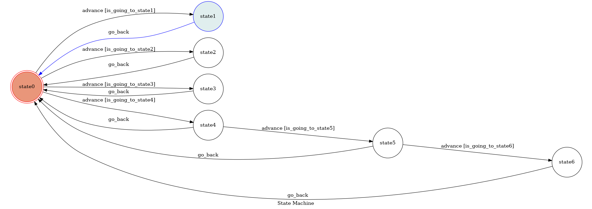

# Messenger_chatbot

##This project is completed by Aaron-Chang.
=================

*   [Introduction](#intro)
*   [FSM Diagram](#diagram)
*   [Execution](#exec)
*   [Reference](#ref)
*  *  *
<h2 id="intro">Introduction</h2>
    This is an IR-based traditional chinese chatbot which can only be implemented on Messenger
platfrom. The json file is from "中國信託(CTBC)", and I use BM25(Best Match25) to complete the
task. Furthermore, the chatbot has 7 states where state0 is the initial state, and only state0
can perform BM25. As regards other states, state1 to state6 are simple FSM states which just 
accept certain strings.
<h2 id="diagram">FSM Diagram</h2>

To change state0 to state1:
    "你好"
To change state0 to state2:
    "你是誰"
To change state0 to state3:
    "今天天氣很好"
To change state0 to state4:
    "今天空氣很糟糕"
To change state4 to state5:
    "你會建議使用哪種口罩"
To change state5 to state6:
    "謝謝"
In state6:
    "謝謝"
To return to state0:
    "return"
<h2 id="exec">Execution</h2>
1. Set up an account in [Facebook Developer][src] and your page.
[src]: https://developers.facebook.com
2. Download ngrok
3. run ngrok on port 8088:(Linux version)
    ./ngrook http 8088
4. run the chatbot
<h2 id="ref">Reference</h2>
1. [Facebook Developer][s1]
[s1]: https://developers.facebook.com
2. [Wikipedia tf-idf][s2]
[s2]: https://zh.wikipedia.org/wiki/Tf-idf
3. [ngrok][s3]
[s3]: https://ngrok.com
