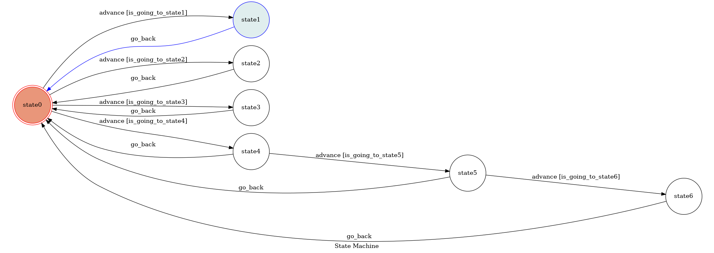

# Messenger_chatbot

This project is completed by Aaron-Chang.

## Introduction
```sh
    This is an IR-based traditional chinese chatbot which can only be implemented on Messenger platfrom. 
The json file is from "中國信託(CTBC)", and I use BM25(Best Match25) to complete the task. Furthermore,the
chatbot has 7 states where state0 is the initial state, and only state0 can perform BM25. As regards other
states, state1 to state6 are simple FSM states which just accept certain strings.
```
## FSM Diagram


* To change state0 to state1:
    *你好*
* To change state0 to state2:
    *你是誰*
* To change state0 to state3:
    *今天天氣很好*
* To change state0 to state4:
    *今天空氣很糟糕*
* To change state4 to state5:
    *你會建議使用哪種口罩*
* To change state5 to state6:
    *謝謝*
* In state6:
    *謝謝*
* To return to state0:
    *return*
## Execution
### 1. Set up an account in Facebook Developer and your page.
### 2. Download ngrok
### 3. run ngrok on port 8088:(Linux version)
```sh
    ./ngrok http 8088
```
### 4. run the chatbot
## Reference
* [Facebook Developer](https://developers.facebook.com)
* [Wikipedia tf-idf](https://en.wikipedia.org/wiki/Tf-idf)
* [ngrok](https://ngrok.com)
